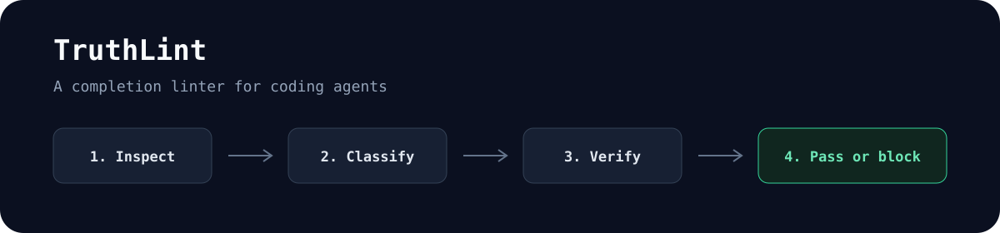

# TruthLint

**Because "done" is a claim until the evidence passes.**

[](https://github.com/niharnm/truthlint/actions/workflows/ci.yml)
[](https://agentskills.io)
[](https://www.python.org/)
[](LICENSE)

TruthLint is a portable Agent Skill that requires coding agents to classify the product, select only the checks that apply, fix in-scope gaps, and attach direct evidence before reporting completion.

It combines agent instructions with a deterministic, fail-closed Python ledger. The catalog includes 160 checks, 20 capability groups, and 15 product archetypes. A game gets game checks. A local-business site gets discovery, contact, consent, and trust checks. A paid game with a store gets both, scoped to the routes that own them.

TruthLint validates completion evidence and process. It does not prove that evidence is honest, that behavior is semantically correct, or that a product meets every legal or security obligation.

For generic presentation, formulaic copy, placeholder content, generated-code tells, and other low-effort project output, pair it with [Project Slop Check](https://github.com/niharnm/project-slop-check). TruthLint records and verifies accepted findings while each skill keeps its own verdict.



## Install

Install it for supported Agent Skills hosts with the [Skills CLI](https://github.com/vercel-labs/skills):

```sh
npx -y skills@1.5.24 add niharnm/truthlint -g -y
```

Then ask your coding agent:

```text
Use $truthlint to finish this repository. Classify every product surface,
apply only relevant checks, fix in-scope gaps, and do not claim completion
until the evidence gate passes.
```

You can also install the repository manually as a `truthlint` directory in your host's Agent Skills location. See the [Agent Skills specification](https://agentskills.io/specification), [Claude Code skills documentation](https://code.claude.com/docs/en/skills), [Codex skills documentation](https://learn.chatgpt.com/docs/build-skills), or [Antigravity skills codelab](https://codelabs.developers.google.com/getting-started-with-antigravity-skills).

For a pinned, inspectable release, download the archive and checksum before copying the extracted `truthlint` directory into a host:

```sh
curl --fail --location --remote-name \
  https://github.com/niharnm/truthlint/releases/download/v0.1.0/truthlint-v0.1.0.zip
curl --fail --location --remote-name \
  https://github.com/niharnm/truthlint/releases/download/v0.1.0/truthlint-v0.1.0.sha256
shasum -a 256 -c truthlint-v0.1.0.sha256
unzip truthlint-v0.1.0.zip
```

## Why it exists

A green unit test is useful evidence. It is not proof that the requested work is complete.

Repositories can also require type checks, builds, browser behavior, error states, accessibility, consent, metadata, production checks, or product facts. A fixed checklist creates the opposite problem by forcing unrelated work onto the product. TruthLint first identifies the task and product surfaces, then builds the applicable gate.

| Product surface | Checks selected | Checks normally excluded |
| --- | --- | --- |
| Browser game | Core loop, input, focus, pause, assets, audio, viewport, runtime faults | Maps, opening hours, service pages, lead promises |
| Local business | Discovery, contact, forms, consent, location, verified trust content | Game loop and save-state checks |
| Internal tool | Authentication, authorization, forms, private routes, state and error handling | Public SEO unless a public shell exists |
| Paid game with store | Game checks on play routes; commerce, privacy, and discovery on store routes | Checks owned by neither surface |
| Embedded widget | Focus, resize, loading, message origins, host integration | Host-owned domain, sitemap, navigation, and 404 behavior |

## How it works

1. **Inspect.** Read applicable instructions, repository structure, tests, routes, integrations, and observable behavior.
2. **Classify.** Review each surface and choose an archetype plus supported capabilities. Automated inference is advisory.
3. **Build the gate.** Create a temporary evidence ledger and add product-specific acceptance checks.
4. **Fix and verify.** Record exact files, commands, tests, logs, runtime observations, or blockers for each selected check.
5. **Refuse false completion.** Exit nonzero while any applicable item is pending, failing, blocked, malformed, or weakly evidenced.

The ledger rejects deleted required checks, altered built-in definitions, undeclared custom checks, blanket `na` results, weak evidence such as `looks good`, invalid timestamps, and evidence assigned to undeclared surfaces.

## Deterministic gate

The bundled script uses only the Python 3.10+ standard library. Keep ledgers outside the target repository or in an ignored temporary directory.

```sh
# Set this to the installed directory that contains TruthLint's SKILL.md.
TRUTHLINT_DIR="/absolute/path/to/truthlint"
LEDGER_PATH="/tmp/truthlint-ledger.json"
REVIEW_PATH="/tmp/truthlint-classification.json"

python3 "$TRUTHLINT_DIR/scripts/task_gate.py" infer .

python3 "$TRUTHLINT_DIR/scripts/task_gate.py" init \
  --mode implementation \
  --root . \
  --archetype game \
  --output "$LEDGER_PATH"

python3 "$TRUTHLINT_DIR/scripts/task_gate.py" classification-template \
  "$LEDGER_PATH" \
  --output "$REVIEW_PATH"

# Review and complete the generated classification file from direct evidence.
python3 "$TRUTHLINT_DIR/scripts/task_gate.py" apply-classification \
  "$LEDGER_PATH" \
  "$REVIEW_PATH"

python3 "$TRUTHLINT_DIR/scripts/task_gate.py" record \
  "$LEDGER_PATH" G01 pass \
  --kind test \
  --target "tests/game-flow.spec.ts" \
  --observed "Start, outcome, restart, and exit cases passed" \
  --scope "play" \
  --capability-unavailable no

python3 "$TRUTHLINT_DIR/scripts/task_gate.py" summary "$LEDGER_PATH"
python3 "$TRUTHLINT_DIR/scripts/task_gate.py" check "$LEDGER_PATH"
```

Do not copy the placeholder classification through unchanged. Every surface and capability decision needs a concrete source, file, command, test, runtime, browser, log, or reason tied to its declared scope.

### Status model

| Status | Meaning |
| --- | --- |
| `pending` | Not assessed. The completion gate fails. |
| `fix` | A gap was observed and still needs work. The gate fails. |
| `pass` | Direct evidence confirms the check for its declared surface. |
| `na` | A conditional check has a concrete product or scope reason. |
| `blocked` | Required authority, facts, access, or host capability is missing. The gate fails. |

## Adaptive classification

TruthLint models mixed products as separate surfaces. A browser game's `/play` route can use the `game` archetype while `/`, `/pricing`, and `/checkout` use public-discovery and commerce capabilities. Each result names the surface it covers.

The classifier reads bounded text input, ignores dependency and build directories, treats fixtures and documentation as weak evidence, reports truncation, and never treats its suggestions as approval. It also skips symlinked files and directories so repository scans do not escape the selected root.

Available archetypes include `non-web`, `web-app`, `marketing`, `local-business`, `professional-services`, `ecommerce`, `saas`, `internal-tool`, `publisher`, `docs`, `portfolio`, `community`, `game`, `microsite`, and `embedded-widget`.

Run the catalog command for every capability and check ID:

```sh
python3 "$TRUTHLINT_DIR/scripts/task_gate.py" catalog
```

## Portability

The core package follows the open Agent Skills directory format. No required rule depends on a vendor-specific tool name. `agents/openai.yaml` is optional interface metadata and can be ignored by other hosts.

If Python or local filesystem access is unavailable, `references/host-adapters.md` defines the equivalent state and stop rules. In that case, enforcement depends on the host and agent following the instructions. TruthLint cannot force a host to load a skill or report evidence honestly.

## Local profiles

Personal communication or publication rules do not belong in the shared defaults. Copy the example to create an ignored local profile:

```sh
cp references/user-profile.example.md references/user-profile.md
```

Fill it only with rules the user explicitly requested. Never put credentials, tokens, private records, or unrelated personal information in the profile. The tracked `.gitignore` keeps `references/user-profile.md` out of commits. A full reinstall that replaces the directory can remove the local file, so back it up or restore it after reinstalling.

Official release archives contain Git-tracked files only and exclude local profiles.

## Repository layout

```text
truthlint/
├── SKILL.md
├── agents/openai.yaml
├── references/
│   ├── adaptive-classification.md
│   ├── communication-and-orchestration.md
│   ├── engineering-protocol.md
│   ├── host-adapters.md
│   ├── site-readiness.md
│   └── user-profile.example.md
└── scripts/
    ├── task_gate.py
    └── test_task_gate.py
```

## Development

```sh
python3 -m unittest -v scripts/test_task_gate.py
uvx ruff==0.16.6 check .
uvx ruff==0.16.6 format --check .
uvx --from skills-ref==0.1.1 agentskills validate "$PWD"
```

Behavior changes should add a regression test. Classifier changes should include a fixture that covers the false positive or false negative. Gate changes should prove both the passing path and the intended failure path.

See [CONTRIBUTING.md](CONTRIBUTING.md), [SECURITY.md](SECURITY.md), and [CHANGELOG.md](CHANGELOG.md).

## License

MIT. See [LICENSE](LICENSE).
